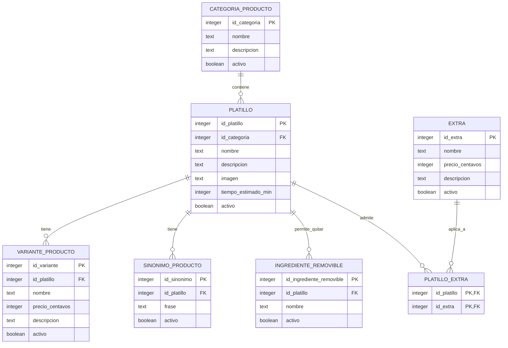

# supabase/

Documentación de esta carpeta: [CLAUDE.md](./CLAUDE.md).

## Diagrama entidad-relación — Menú (US-02-P1)

Refleja el esquema real definido en `migrations/20260929100000_crear_esquema_menu.sql`
y `migrations/20260929130000_platillo_extra_y_fix_permisos.sql`.

- **categoria_producto**: las secciones del menú (Entradas, Hamburguesas, Bebidas, etc.).
- **platillo**: cada producto del menú, ligado a una categoría.
- **variante_producto**: opciones de un mismo platillo con precio propio (ej. tamaños, preparaciones). Todo platillo tiene al menos una variante, aunque sea "Único", porque el precio vive aquí, no en `platillo`.
- **sinonimo_producto**: formas alternativas de nombrar un platillo, para que el agente lo reconozca.
- **ingrediente_removible**: ingredientes que el cliente puede pedir quitar de un platillo, sin cambio de precio.
- **extra**: complementos cobrables (ej. Totopos, Aguacate).
- **platillo_extra**: qué extras aplican a qué platillo (ej. "Espuelas" solo en ciertos cortes). Sin esta tabla el backend no puede validar un extra antes de cobrarlo.

Todas las tablas tienen RLS activo, sin políticas, y solo `service_role` (la API) tiene `GRANT select` — el menú no se lee directo desde el frontend ni con la llave `anon` (D12, D15).
